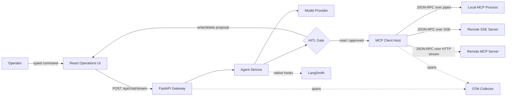
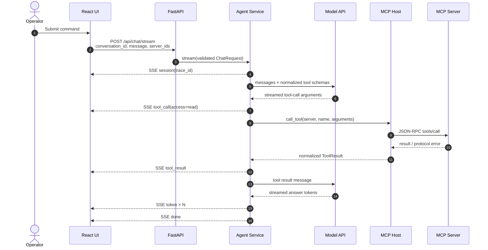

# NexusMCP Workflow and Network Trace Specification

## 1. Scope

This document defines the runtime path from a React operator action through FastAPI, the model gateway, MCP protocol sessions, and stdio or remote streaming transports. It is both an implementation map and an observability contract.

## 2. Runtime topology



## 3. Primary sequence: read-only tool



### Invariants

- The request is Pydantic-validated before the agent sees it.
- Only tools from the selected catalog are advertised to the model.
- The model receives a stable alias; the host retains the authoritative `(server_id, tool_name)` mapping.
- Arguments must parse to a JSON object before policy or execution.
- Tool failure is returned as structured evidence to the model and UI.

## 4. Sensitive sequence: write/delete tool

```mermaid
sequenceDiagram
    autonumber
    actor O as Operator
    participant UI as React UI
    participant API as FastAPI
    participant AG as Agent Coroutine
    participant G as Approval Gate
    participant HOST as MCP Host
    participant MCP as MCP Server

    AG->>G: create(exact arguments, access, expiry)
    G-->>AG: PendingToolCall(id)
    AG-->>UI: SSE hitl_required(PendingToolCall)
    Note over AG,G: Agent waits; no MCP call has occurred
    UI->>O: Modal with proposed JSON diff
    O->>UI: Approve once / reject
    UI->>API: POST /api/hitl/{id}/decision
    API->>G: compare pending state; record decision
    G-->>AG: release waiter with decision
    alt approved before expiry
        AG->>HOST: call_tool(exact arguments)
        HOST->>MCP: tools/call
        MCP-->>HOST: result
    else rejected or expired
        AG-->>AG: synthesize rejected tool result
    end
    AG-->>UI: SSE tool_result
    AG-->>UI: tokens then done
```

Security invariant: the second HTTP request changes approval state only. It never executes the tool directly. The original agent path resumes and executes at most once. Production shared-state implementations must use an atomic state transition and bind authenticated identity plus a canonical payload hash.

## 5. Connection establishment

### stdio

1. API validates command, arguments, environment, and working directory.
2. Host creates an `AsyncExitStack` dedicated to the server.
3. SDK spawns the process and exposes asynchronous read/write streams.
4. `ClientSession` sends MCP `initialize`; both peers negotiate protocol version and capabilities.
5. Host sends `tools/list`, validates each schema, and publishes normalized descriptors.
6. On disconnect or application shutdown, the exit stack closes the session, pipes, and child process in reverse order.

The pipe carries framed JSON-RPC. OS process exit, EOF, invalid frames, and stderr diagnostics are transport concerns; tool `isError` remains an application concern.

### SSE

1. Host creates an HTTP/SSE context with configured authentication and injected W3C trace headers.
2. SSE delivers server-to-client messages; a negotiated POST endpoint carries client-to-server JSON-RPC.
3. The parser joins SSE `data:` lines and correlates JSON-RPC IDs.
4. Connection loss marks the server degraded. Reconnect behavior must honor protocol/session semantics rather than replaying writes.

### Streamable HTTP

1. Host opens the SDK streamable HTTP transport with W3C headers.
2. Requests carry JSON-RPC payloads over HTTP POST. Responses may be immediate JSON or an event stream.
3. Session IDs, redirects, protocol version, and content type are validated by the SDK transport.
4. Cancellation propagates through the client span and HTTP request where supported.

## 6. SSE application event contract

Every frame has an SSE event name and a JSON envelope:

```text
event: token
data: {"event":"token","data":{"text":"partial"},"trace_id":"…"}

```

| Event | Required data | UI transition |
|---|---|---|
| `session` | `conversation_id` | Attach trace ID to assistant turn |
| `token` | `text` | Append text; remain streaming |
| `tool_call` | call/server/tool/access/arguments | Add execution activity |
| `hitl_required` | complete pending record | Open blocking decision modal; state `waiting` |
| `tool_result` | call ID and normalized result | Add evidence activity |
| `error` | safe message, optional detail | Mark turn error if no response text |
| `done` | terminal status, optional turn | Mark turn terminal; release request lock |

Frames are separated by a blank line. The frontend retains incomplete text between reads because network chunk boundaries are arbitrary.

## 7. Trace map

Suggested span hierarchy:

```text
HTTP POST /api/chat/stream
└── agent.chat [conversation.id]
    ├── model.chat.completions [model, turn]
    ├── approval.wait [tool, access, linked decision span]
    └── mcp.tool.call [server.id, tool.name, access]
        └── HTTP client / MCP protocol span OR local stdio client span
```

The host injects current W3C context into remote transport headers. LangSmith’s native environment hook is enabled with `LANGCHAIN_TRACING_V2=true`; keys and project names remain deployment configuration. Audit events carry approval/server/tool identifiers independently from trace sampling.

## 8. State ownership

| State | Reference owner | Scale-out owner |
|---|---|---|
| Connected MCP sessions | MCP host process | Dedicated connection workers |
| Tool catalog | MCP host memory | Versioned cache/catalog service |
| Conversation window | Agent process deque | Durable tenant-scoped memory store |
| Pending approvals | Approval gate memory | Transactional database + event broker |
| Streaming UI state | React hook | Browser; resumable event cursor on server |
| Audit trail | JSONL audit sink | Append-only SIEM/object store |

The reference intentionally keeps live coordination in one process. Do not set multiple backend workers until pending approvals and conversation routing use shared infrastructure; otherwise a decision can land on a worker that does not own the waiter.

## 9. Failure matrix

| Failure point | Observable behavior | Required containment |
|---|---|---|
| Request validation | HTTP 422 | No model or MCP work starts |
| Model credentials absent | `error`, then `done(blocked)` | Registry remains usable |
| Model stream fails | Diagnostic exception + safe SSE error | Turn terminates; no fabricated answer |
| Unknown tool alias | Error tool result to model | Host never called |
| Invalid argument JSON | Error tool result | Approval never created |
| Approval expires | Audit expiry + rejected result | Fail closed |
| Operator double-decides | HTTP 404 on second transition | At-most-once release |
| MCP returns `isError` | Normalized tool result | Model explains failure; no false success |
| MCP transport throws | Server becomes degraded | Other sessions remain healthy |
| Browser disconnects | Stream cancellation | Agent/transport cancellation and expiry cleanup |

## 10. Deployment gates

Before production release:

1. Put authentication/tenant authorization and SSRF/egress policy in front of connection routes.
2. Inject remote credentials from a secret manager; remove browser-supplied header capability from public policy.
3. Replace process-local memory and approvals with shared transactional services.
4. Add resumable SSE IDs, cancellation tests, timeouts, quotas, and backpressure.
5. Validate tool arguments against the captured schema immediately before execution.
6. Export OTLP to the organization collector and redact model/tool content.
7. Ship audit JSON to immutable storage and test decision reconciliation.
8. Load-test time-to-first-token, connection counts, payload bounds, and graceful shutdown.

